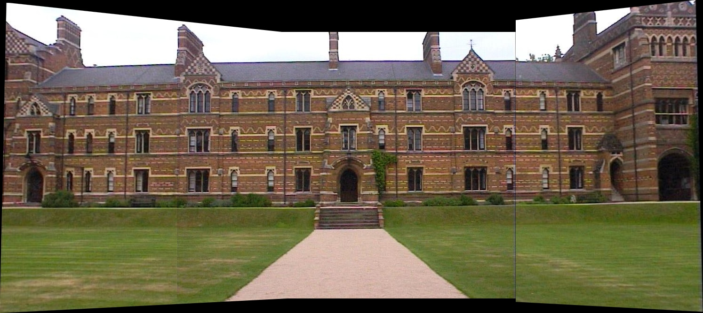

## Part 2 

This part of the Computer Vision repo caters to important computer vision problems: 

1. Feature detectors and descriptors: Harris Corner detector, 
2. Homography estimation using SIFT, KNN and RANSAC and Image stiching

